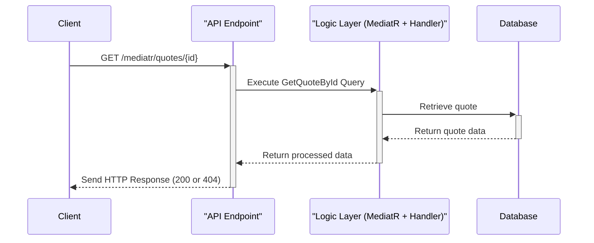
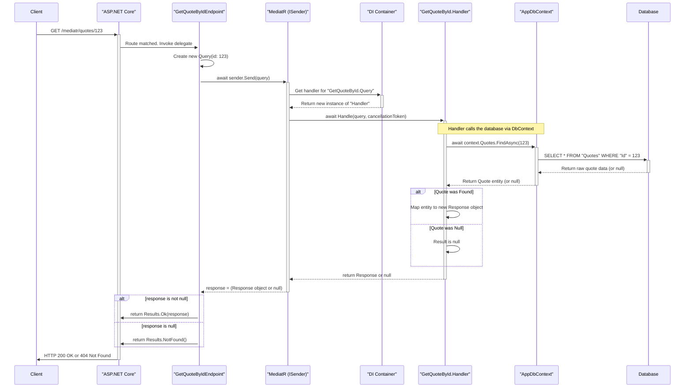

# Contains
- .Net 9 Minimal WebAPI
    - IEndpoint & EndpointExtensions configuration
- EF Core (SqlLocalDB)
- Scalar
- Global Exception Handling
- Serilog

- MediatR (New for this template) 

## Notes
- Discriminated Unions
  - Used here to clearly indicate return type from MediatR handlers.
```csharp
public abstract record CreateQuoteResult;
public sealed record CreateQuoteSuccess(int NewQuoteId) : CreateQuoteResult;
public sealed record CreateQuoteValidationFailure(string ErrorMessage) : CreateQuoteResult;

...
public async Task<CreateQuoteResult> Handle(CreateQuoteCommand request, CancellationToken cancellationToken)
{
     return new CreateQuoteValidationFailure("Author and Content are both required.");
     ...
     return new CreateQuoteSuccess(quote.Id);
}

return result switch
{
    CreateQuoteSuccess s => Results.CreatedAtRoute("GetQuoteById", new { id = s.NewQuoteId }),
    CreateQuoteValidationFailure f => Results.BadRequest(f.ErrorMessage),
    _ => Results.StatusCode(500)
};
```
Of course. This is a fantastic question because `sealed` is a simple keyword, but in this specific context, it is a critical part of a powerful and modern C# pattern.

### The Direct Meaning of `sealed`

In C#, the `sealed` modifier, when applied to a class or record, means one thing:

**"This type cannot be inherited from."**

It marks the type as the final, complete version in its inheritance chain. You are explicitly forbidding any other developer from creating a new class that derives from it.

For example, this would be illegal and cause a compiler error:

```csharp
// This will NOT compile because CreateQuoteSuccess is sealed
public record SpecialSuccess(int Id, string Message) : CreateQuoteSuccess(Id);
```

### The Pattern: Discriminated Unions

The use of `sealed` here is essential to implementing a design pattern called a **Discriminated Union** (also known as a sum type, tagged union, or a closed type hierarchy).

A Discriminated Union is a type that can hold a value from a **fixed, closed set** of other types.

Let's break down how your code creates this pattern:

1.  **The Abstract Base (`CreateQuoteResult`):**
    *   This is the "umbrella" or the "union" type. It defines the common concept: "a result from the create quote operation."
    *   It's `abstract`, which means you can never create an instance of it directly. It exists only to be inherited from.

2.  **The Sealed Implementations (`CreateQuoteSuccess`, `CreateQuoteValidationFailure`):**
    *   These are the distinct, possible, concrete outcomes. A `CreateQuoteResult` will always be *one of these specific types*.
    *   The `sealed` keyword is the key. By sealing these derived records, you are telling the compiler and other developers: "These are the **only** possible outcomes. This set is complete and cannot be extended."

This pattern guarantees that a variable of type `CreateQuoteResult` can *only* hold an instance of `CreateQuoteSuccess` or `CreateQuoteValidationFailure`. There are no other possibilities.

### Conceptual Diagram

Here is a diagram illustrating the concept. Think of the Discriminated Union as a container that can only hold one of its pre-defined shapes.

```mermaid
graph TD
    subgraph Discriminated Union (A Closed Set of Possible Results)
        direction TB
        A[CreateQuoteResult <br><i>(abstract base)</i>]
        B[CreateQuoteSuccess <br><b>(sealed)</b>]
        C[CreateQuoteValidationFailure <br><b>(sealed)</b>]
    end

    B -- is a --> A
    C -- is a --> A

    style A fill:#f9f,stroke:#333,stroke-width:2px,stroke-dasharray: 5 5
    style B fill:#ccffcc,stroke:#333,stroke-width:2px
    style C fill:#ffcccc,stroke:#333,stroke-width:2px

    note right of B : Cannot be inherited from
    note right of C : Cannot be inherited from
```

### Why This Pattern is a Best Practice

Using a Discriminated Union is vastly superior to older error-handling methods for several reasons:

1.  **Clarity and Honesty:** Your method signature `Task<CreateQuoteResult>` is extremely honest. It clearly states, "I will return a `CreateQuoteResult`, which you know can be either a success or a validation failure." It makes the possible outcomes explicit.

2.  **No More `null` Checks:** You don't return `null` to indicate failure. Returning `null` is ambiguous—was it a failure? Was the object not found? This pattern replaces `null` with a rich, descriptive failure object.

3.  **No Exceptions for Predictable Errors:** For predictable failures like user validation errors, throwing exceptions is considered an anti-pattern. Exceptions are for *exceptional*, unexpected events. This pattern handles validation as a normal, expected outcome of the operation, leading to cleaner and more performant code (no `try-catch` blocks for simple validation).

4.  **Enables Exhaustive `switch` Expressions:** This is the biggest benefit. Because the set of outcomes is *closed* and *known*, the compiler can help you write safer code. When you use a `switch` expression to handle the result, the compiler knows all possible types and can warn you if you forget to handle one.

    ```csharp
    // The compiler knows that 'result' can only be Success or ValidationFailure.
    // This makes your code more robust.
    return result switch
    {
        CreateQuoteSuccess s => Results.Ok(s),
        CreateQuoteValidationFailure f => Results.BadRequest(f.ErrorMessage),
        // If you were to add a third sealed result type and forget it here,
        // the compiler would warn you that your switch is not exhaustive!
    };
    ```

In summary, `sealed` is the linchpin that locks down your inheritance hierarchy, turning a simple set of classes into a powerful, type-safe, and highly expressive Discriminated Union pattern.


## MediatR Flow
- ex: Api.Features.Quotes.GetQuoteById.cs

1.  **Handler Collection (Correct!)**: At application startup, the dependency injection (DI) container scans your project's assemblies for any class that implements `IRequestHandler<TRequest, TResponse>`. It registers each of these handlers so that MediatR knows which class is responsible for handling which specific request type. In your case, it registers `GetQuoteById.Handler` as the designated handler for `GetQuoteById.Query`.

2.  **ISender (Correct!)**: Precisely. `ISender` is a lightweight interface provided by MediatR whose sole purpose is to "send" a request object into the MediatR pipeline. You request it from the DI container (in Minimal APIs, this happens automatically via parameter binding, which is what `[FromServices]` would do under the hood). When you call `sender.Send(new GetQuoteById.Query(id))`, MediatR looks at the type of the object you passed in (`GetQuoteById.Query`) and says, "Aha! I have `GetQuoteById.Handler` registered for this type." It then resolves an instance of that handler from the DI container and invokes its `Handle` method, passing along your query object.

### Summary of the Flow

1.  **Request Initiation**: A client sends a `GET` request to your API.
2.  **Routing**: ASP.NET Core's routing middleware matches the URL (`/mediatr/quotes/{id}`) and determines that the `GetQuoteByIdEndpoint` delegate should handle it.
3.  **Endpoint Execution**: The delegate is invoked. The framework provides the `ISender` service and the `id` from the URL.
4.  **Query Creation**: Inside your endpoint, you create an instance of the `GetQuoteById.Query` record, encapsulating the data needed for the operation.
5.  **Dispatch**: You call `sender.Send()` with the query object. This hands control over to MediatR.
6.  **Handler Resolution**: MediatR asks the Dependency Injection container for the handler registered for `GetQuoteById.Query`. The DI container creates an instance of `GetQuoteById.Handler`, injecting its required dependency (`AppDbContext`).
7.  **Business Logic**: MediatR invokes the `Handle` method on the handler instance. The handler executes the core logic: it uses the `AppDbContext` to query the database for the quote.
8.  **Data Retrieval**: The handler awaits the database call.
9.  **Response Mapping**:
    *   If a quote is found, the handler maps the database entity to the `GetQuoteById.Response` record and returns it.
    *   If not found, it returns `null`.
10. **Return to Sender**: The response (`Response` object or `null`) travels back up the call stack from the handler to MediatR, and finally `sender.Send()` returns that result to your endpoint delegate.
11. **HTTP Result**: The endpoint delegate checks the returned value and uses ASP.NET Core's `Results` helpers to create the appropriate HTTP response (`200 OK` with the data or a `404 Not Found`).

### Diagrams of the flow  
  
#### High Level

  
#### Detailed Flow  
