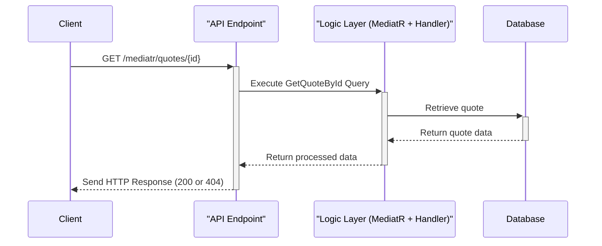
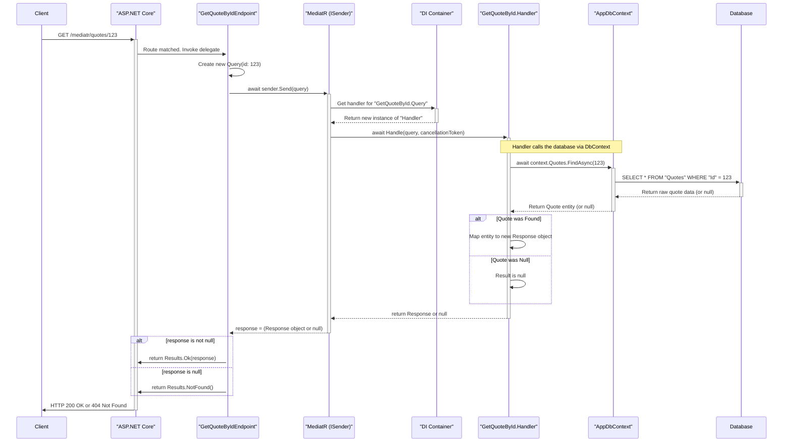

# Contains
- .Net 9 Minimal WebAPI
    - IEndpoint & EndpointExtensions configuration
- EF Core (SqlLocalDB)
- Scalar
- Global Exception Handling
- Serilog

- MediatR 

## MediatR Flow
- ex: Api.Features.Quotes.GetQuoteById.cs

1.  **Handler Collection (Correct!)**: At application startup, the dependency injection (DI) container scans your project's assemblies for any class that implements `IRequestHandler<TRequest, TResponse>`. It registers each of these handlers so that MediatR knows which class is responsible for handling which specific request type. In your case, it registers `GetQuoteById.Handler` as the designated handler for `GetQuoteById.Query`.

2.  **ISender (Correct!)**: Precisely. `ISender` is a lightweight interface provided by MediatR whose sole purpose is to "send" a request object into the MediatR pipeline. You request it from the DI container (in Minimal APIs, this happens automatically via parameter binding, which is what `[FromServices]` would do under the hood). When you call `sender.Send(new GetQuoteById.Query(id))`, MediatR looks at the type of the object you passed in (`GetQuoteById.Query`) and says, "Aha! I have `GetQuoteById.Handler` registered for this type." It then resolves an instance of that handler from the DI container and invokes its `Handle` method, passing along your query object.

### Summary of the Flow

1.  **Request Initiation**: A client sends a `GET` request to your API.
2.  **Routing**: ASP.NET Core's routing middleware matches the URL (`/mediatr/quotes/{id}`) and determines that the `GetQuoteByIdEndpoint` delegate should handle it.
3.  **Endpoint Execution**: The delegate is invoked. The framework provides the `ISender` service and the `id` from the URL.
4.  **Query Creation**: Inside your endpoint, you create an instance of the `GetQuoteById.Query` record, encapsulating the data needed for the operation.
5.  **Dispatch**: You call `sender.Send()` with the query object. This hands control over to MediatR.
6.  **Handler Resolution**: MediatR asks the Dependency Injection container for the handler registered for `GetQuoteById.Query`. The DI container creates an instance of `GetQuoteById.Handler`, injecting its required dependency (`AppDbContext`).
7.  **Business Logic**: MediatR invokes the `Handle` method on the handler instance. The handler executes the core logic: it uses the `AppDbContext` to query the database for the quote.
8.  **Data Retrieval**: The handler awaits the database call.
9.  **Response Mapping**:
    *   If a quote is found, the handler maps the database entity to the `GetQuoteById.Response` record and returns it.
    *   If not found, it returns `null`.
10. **Return to Sender**: The response (`Response` object or `null`) travels back up the call stack from the handler to MediatR, and finally `sender.Send()` returns that result to your endpoint delegate.
11. **HTTP Result**: The endpoint delegate checks the returned value and uses ASP.NET Core's `Results` helpers to create the appropriate HTTP response (`200 OK` with the data or a `404 Not Found`).

### Diagrams of the flow  
  
#### High Level

  
#### Detailed Flow  
